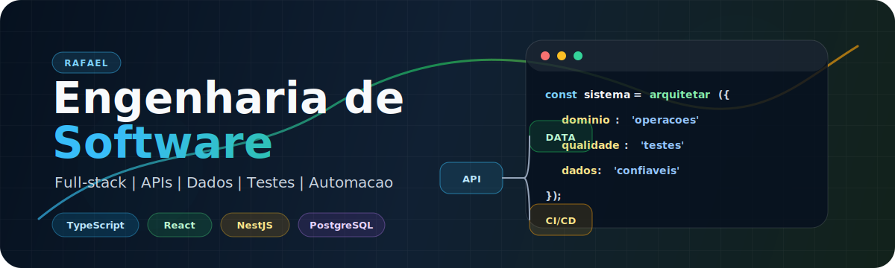

  

<h1 align="center">Rafael | Engenharia de Software</h1>

  
  
  

  Desenvolvedor em evolução, construindo aplicações web completas e transformando rotinas operacionais em sistemas mais claros, seguros e fáceis de usar.

  Tenho trabalhado com projetos que combinam frontend, backend, banco de dados, automação e importação de dados. Meu foco atual é criar ferramentas que saem do improviso de planilhas e viram plataformas permanentes, com autenticação, histórico, auditoria e uma experiência melhor para quem usa no dia a dia.

## Painel de desenvolvimento

  
  

  

  

## Stack principal

  
  
  
  
  
  
  
  
  
  
  

## Engenharia em foco

<table>
  <tr>
    <td width="25%"><b>Arquitetura</b> Modelagem de sistemas, módulos, regras de negócio e integração entre frontend, API e banco.</td>
    <td width="25%"><b>Backend</b> APIs com autenticação, permissões, Prisma, PostgreSQL e estrutura pronta para crescer.</td>
    <td width="25%"><b>Dados</b> Importação, limpeza e migração de planilhas para modelos mais confiáveis e rastreáveis.</td>
    <td width="25%"><b>Qualidade</b> Testes, validações, revisão de fluxo e atenção à experiência real de uso.</td>
  </tr>
</table>

## Projetos em destaque

  
  

  
  

## No que estou focando agora

- Aplicações web com Next.js, React, TypeScript e Tailwind CSS.
- APIs com NestJS, autenticação, permissões, Prisma e PostgreSQL.
- Migração de processos baseados em Excel para sistemas com dados estruturados.
- Testes com Vitest e Playwright.
- Fundamentos de lógica digital com decodificadores, somadores, subtratores e flip-flops.

## Como eu gosto de construir

Gosto de transformar problemas confusos em fluxos simples: entender a rotina real, modelar os dados, criar telas diretas, validar regras importantes e deixar o sistema pronto para crescer. Procuro escrever código organizado, testável e útil para quem vai depender dele todos os dias.

## Contato

Aberto a aprender, colaborar e construir projetos que resolvem problemas reais. Pode me chamar por aqui no GitHub.
